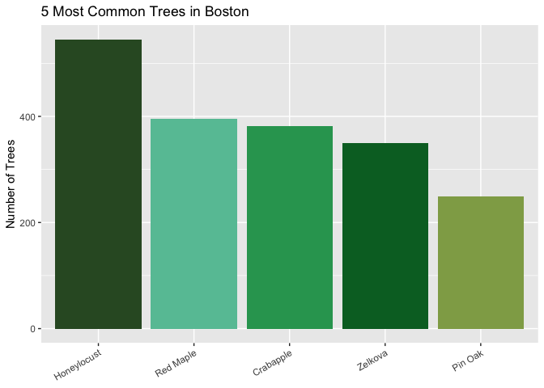

<!-- README.md is generated from README.Rmd. Please edit that file -->

# bosTrees

<!-- badges: start -->
<!-- badges: end -->

`bosTrees` is a data package that contains information on trees and tree
planting sites in Boston, Massachusetts. This package includes two
distinct datasets, each offering unique insights into the urban forestry
of Boston:

- `bosTrees` pulls in data on 6,836 primary street trees located
  throughout Boston.

- `camTrees` pulls in data on 38,050 trees and tree planting sites
  owned, planted or maintained by the City of Cambridge, the
  Massachusetts Department of Conservation and Recreation, and MIT,
  Harvard University and other private organizations

The data pulled for `camTrees` is maintained by the Cambridge Public
Works and updated regularly by the City Arborist while the `bosTrees`
dataset was created by the City of Boston’s GIS Team.

## Installation

``` r
# Do the following once
# install.packages("devtools")

# Then, install the package
devtools::install_github("harvard-ufds/bosTrees")
```

## Example \[to be edited\]

This is a basic example which shows you how to solve a common problem:

    #> 
    #> The downloaded binary packages are in
    #>  /var/folders/mp/vd1ynsh93v51m1fmz6n99n440000gn/T//RtmpI6hwC1/downloaded_packages
    #> ── R CMD build ─────────────────────────────────────────────────────────────────
    #> * checking for file ‘/private/var/folders/mp/vd1ynsh93v51m1fmz6n99n440000gn/T/RtmpI6hwC1/remotesf7556af06579/harvard-ufds-bosTrees-8e6b5e5/DESCRIPTION’ ... OK
    #> * preparing ‘bosTrees’:
    #> * checking DESCRIPTION meta-information ... OK
    #> * checking for LF line-endings in source and make files and shell scripts
    #> * checking for empty or unneeded directories
    #> * building ‘bosTrees_0.0.0.9000.tar.gz’



What is special about using `README.Rmd` instead of just `README.md`?
You can include R chunks like so:

``` r
summary(cars)
#>      speed           dist       
#>  Min.   : 4.0   Min.   :  2.00  
#>  1st Qu.:12.0   1st Qu.: 26.00  
#>  Median :15.0   Median : 36.00  
#>  Mean   :15.4   Mean   : 42.98  
#>  3rd Qu.:19.0   3rd Qu.: 56.00  
#>  Max.   :25.0   Max.   :120.00
```

You’ll still need to render `README.Rmd` regularly, to keep `README.md`
up-to-date. `devtools::build_readme()` is handy for this. You could also
use GitHub Actions to re-render `README.Rmd` every time you push. An
example workflow can be found here:
<https://github.com/r-lib/actions/tree/v1/examples>.

You can also embed plots, for example:


In that case, don’t forget to commit and push the resulting figure
files, so they display on GitHub and CRAN.
