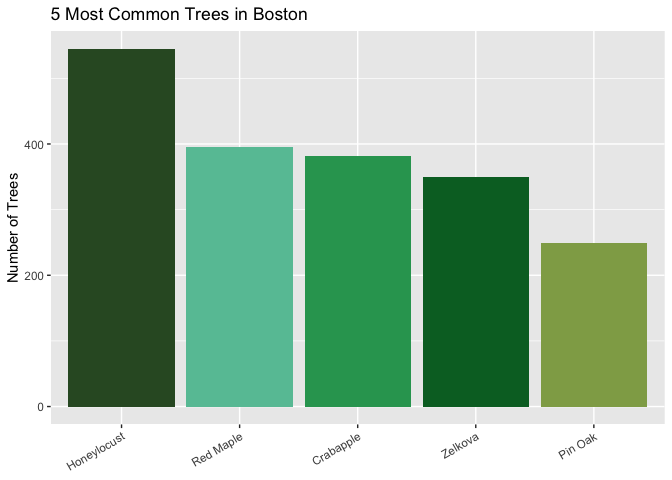
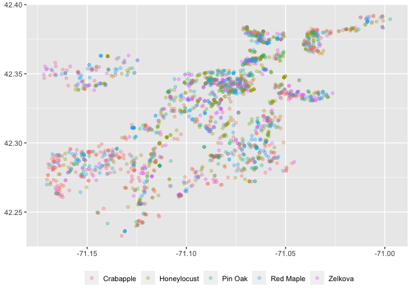

<!-- README.md is generated from README.Rmd. Please edit that file -->

# bosTrees

<!-- badges: start -->
<!-- badges: end -->

`bosTrees` is a data package that contains information on trees and tree
planting sites in Boston, Massachusetts. This package includes two
distinct datasets, each offering unique insights into the urban forestry
of Boston:

- `bosTrees` pulls in data on 6,836 primary street trees located
  throughout Boston.

- `camTrees` pulls in data on 38,050 trees and tree planting sites
  owned, planted or maintained by the City of Cambridge, the
  Massachusetts Department of Conservation and Recreation, and MIT,
  Harvard University and other private organizations

The data pulled for `camTrees` is maintained by the Cambridge Public
Works and updated regularly by the City Arborist while the `bosTrees`
dataset was created by the City of Boston’s GIS Team.

## Installation

``` r
# Do the following once
# install.packages("devtools")

# Then, install the package
devtools::install_github("harvard-ufds/bosTrees")
```

## Examples

This is a basic example which shows you how to solve a common problem:

    #> 
    #> The downloaded binary packages are in
    #>  /var/folders/yv/81c94rx95gdd713rrm8n1l080000gn/T//Rtmp095EKR/downloaded_packages
    #> ── R CMD build ─────────────────────────────────────────────────────────────────
    #> * checking for file ‘/private/var/folders/yv/81c94rx95gdd713rrm8n1l080000gn/T/Rtmp095EKR/remotesb1a3e390de7/harvard-ufds-bosTrees-9fd75f5/DESCRIPTION’ ... OK
    #> * preparing ‘bosTrees’:
    #> * checking DESCRIPTION meta-information ... OK
    #> * checking for LF line-endings in source and make files and shell scripts
    #> * checking for empty or unneeded directories
    #> * building ‘bosTrees_0.0.0.9000.tar.gz’


Trees are fun to visualize! Here is a simple bargraph of the 5 most
common trees in Boston, MA:

``` r
# Find the names of the 5 most common species
top5 <- bosTrees %>%
  count(CommonName) %>%
  arrange(desc(n)) %>%
  drop_na(CommonName) %>%
  slice_max(n = 5, n)

# Filter down to 5 common species
most_common <- bosTrees %>%
  filter(CommonName %in% top5$CommonName)

# Create a bargraph of the 5 top species
ggplot(most_common, aes(x = fct_infreq(CommonName), fill = factor(CommonName))) +
  geom_bar() +
  theme(axis.title.x = element_blank(),
        axis.text.x =
          element_text(angle = 30,
                       vjust = 1,
                       hjust=1),
        legend.position = "none") +
  labs(title = "5 Most Common Trees in Boston",
       y = "Number of Trees") +
  scale_fill_manual(values = c("#2ca25f", "#31572c", "#90a955", "#66c2a4", "#006d2c"))
```



You can even plot the latitudes and longitudes of the common trees to
see them in a map view:

``` r
ggplot(most_common, aes(x = Longitude, y = Latitude, color = CommonName)) +
  geom_point(alpha = 0.3) +
  theme(axis.title.x = element_blank(),
        axis.title.y = element_blank(),
        legend.title = element_blank(),
        legend.position = "bottom")
```



## References

**Data originally published in:**

- **`bosTrees`** dataset:
  <https://data.boston.gov/dataset/primary-street-trees-public>

- **`camTrees`** dataset:
  <https://www.cambridgema.gov/GIS/gisdatadictionary/Environmental/ENVIRONMENTAL_StreetTrees>
